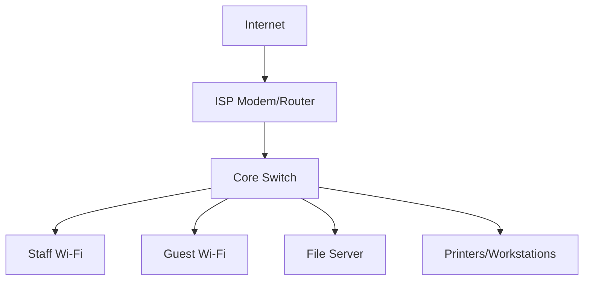

# Network Structure and Security Analysis

## Overview

Based on network installation and support work performed at Squareline Technologies Limited, this analysis examines a typical flat small-office network topology and identifies structural weaknesses.

## Current Network Layout



```mermaid
graph TD
    A[Internet] --> B[ISP Modem/Router]
    B --> C[Firewall with ACLs]
    C --> D[Core Switch]
    
    D --> E[VLAN 10 - Staff]
    D --> F[VLAN 20 - Guest]
    D --> G[VLAN 30 - Servers]
    
    G --> H[File Server]
    E --> I[Staff Devices]
    F --> J[Guest Devices]
    
    style E fill:#4CAF50,color:white
    style F fill:#FF9800,color:white
    style G fill:#2196F3,color:white
